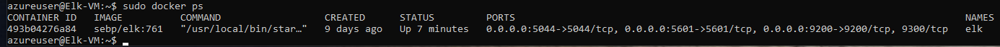

## Automated ELK Stack Deployment

The files in this repository were used to configure the network depicted below.

These files have been tested and used to generate a live ELK deployment on Azure. They can be used to either recreate the entire deployment pictured above. Alternatively, select portions of the YAML file may be used to install only certain pieces of it, such as Filebeat.

This document contains the following details:
- Description of the Topology
- Access Policies
- ELK Configuration
  - Beats in Use
  - Machines Being Monitored
- How to Use the Ansible Build

### Description of the Topology

The main purpose of this network is to expose a load-balanced and monitored instance of DVWA, the D*mn Vulnerable Web Application.

Load balancing ensures that the application will be highly available, in addition to restricting inbound access to the network.
- The main purpose of a load balancer is to distribute web traffic across multiple servers, load balancing helps with making sure our servers don't get
overwhelmed with inbound traffic to our site. In this case our load balancer was installed in front of our VM's to:
-protect web applications
-document traffic configuration tools
-deny communications with a malicious IP address
-manage web traffic

Jump Box:
-A jumpbox is an Azure virtual machine that's running Linux or Windows and to which user can connect via the Remote Desktop Protocol (RDP) 
or Secure Shell (SSH). A Jump Box or "Jump Server" is a gateway on a network used to access and manage devices in adifferent security zones.
Or, you can think of a Jump Box as a bridge between trusted networks, which can help with security and prevent exposure from public IP addresses 
associated with the VM. 

Integrating an ELK server allows users to easily monitor the vulnerable VMs for changes to the file system and system metrics.
- Filebeat is a lightweight shipper for forwarding and centralizing log data. Installed as an agent on your servers, Filebeat monitors
the log files or location that you specify, collects log events, and forwards them either to Elasticsearch or Logstash.
- Metricbeat takes the metrics and statistics that it collects and ships them to the output that you specify, such as Elasticsearch or Logstash.
Metricbeat helps you monitor your servers by collecting metrics from the system and servers running on the server, such as apache.

The configuration details of each machine may be found below.

| Name       | Function |        IP Address      | Operating System |
|----------  |----------|------------------------|------------------|
| Jump Box   | Gateway  | 10.0.0.4               | Linux 18.04 LTS  |
| Web-1      | webserver| 10.0.0.5               | Linux 18.04 LTS  |
| Web-2      | webserver| 10.0.0.6               | Linux 18.04 LTS  |
| Web-3      | webserver| 10.0.0.7               | Linux 18.04 LTS  |
| ElkServer  | Kibana   | 10.1.0.5               | Linux 18.04 LTS  |

### Access Policies

The machines on the internal network are not exposed to the public Internet. 

Only the JumpBox machine can accept connections from the Internet. Access to this machine is only allowed from the following IP addresses:
- Your personal IP 

Machines within the network can only be accessed by SSH.
 Jumpbox: Private IP 10.0.0.4

A summary of the access policies in place can be found in the table below.

| Name     | Publicly Accessible | Allowed IP Addresses |
|----------|---------------------|----------------------|
| Jump Box | Yes                 | 174.20.115.144       |
| Web-1    | NO                  | 10.0.0.5             |
| Web-2    | NO                  | 10.0.0.6             |
| Web-3    | NO                  | 10.0.0.7             |
| Elk-VM   | Yes                 | 174.20.115.144       |

### Elk Configuration

Ansible was used to automate configuration of the ELK machine. No configuration was performed manually, which is advantageous because...
- Ansible focuses on bringing a certain state of operation to a sever.
- Can automate tasks with using a single playbook.

The playbook implements the following tasks:
- Install Docker.io
- Install Python3-pip
- Install docker container
- Launch docker container: Elk 
- Command: sysctl -w vm.max_map_count=262144

The following screenshot displays the result of running `docker ps` after successfully configuring the ELK instance.

### Target Machines & Beats
This ELK server is configured to monitor the following machines:
- Web-1 DVWA | 10.0.0.5
- Web-2 DVWA | 10.0.0.6
- Web-3 DVWA | 10.0.0.7

We have installed the following Beats on these machines:
- FileBeat 
- Metricbeat 

These Beats allow us to collect the following information from each machine:
- Filebeat- centralizes log data and forwards it from your target machines. It will also monitor the log files you specify i.e login attemps, and will
  forward them to the log server 
- Metricbeat- This will collect your machine data such as CPU usage, inbound and outbound traffic, and memory usage and will send the data to the Elk server 

### Using the Playbook
In order to use the playbook, you will need to have an Ansible control node already configured. Assuming you have such a control node provisioned: 

SSH into the control node and follow the steps below:
- Copy the playbook file to /etc/ansible.
- Update the configuration file to include the private IP's of your webservers and Elk-VM 
- Run the playbook, and navigate to Elk VM to check that the installation worked as expected. /etc/ansible/host/ this should include:
- [webservers]
  - 10.0.0.5 ansible_python_interpreter/usr/bin/python3
  - 10.0.0.6 ansible_python_interpreter/usr/bin/python3
  - 10.0.0.7 ansible_python_interpreter/usr/bin/python3
- [Elk]
  - 10.1.0.5 ansible_python_interpreter/usr/bin/python3

- To copy the file_configuration head to 
- /etc/ansible/file/filebeat-configuration.yml
- _Which file do you update to make Ansible run the playbook on a specific machine? How do I specify which machine to install the ELK server on versus which to install Filebeat on?
- you should edit the /etc/ansible/hosts file to add the private IP's of your webservers and Elk-VM
- _Which URL do you navigate to in order to check that the ELK server is running?
- This is how your link will look after you have set up your Elk Server.
- http://[your.ELK-VM-PublicIP]:5601/app/kibana  
- after you type in the URL you should have a page that looks like this

 